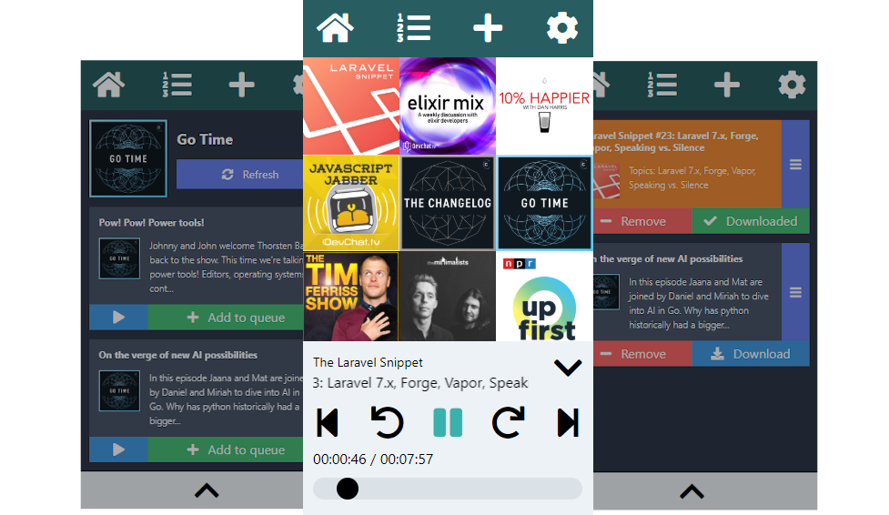

# Podrain



Podrain is a web-based podcast app with offline capabilities. It was built to scratch my own itch, and there are a *lot* of rough edges (I would define it's current state as "usable alpha"), but I'm using the app for all of my podcast-listening needs now. Some features include:

- Pure focus on podcasts (no radio, news, video podcasts, music, etc.)
- Mobile-first design
- Customizable episode queue
- All podcast data is stored in your browser, no need to sign up for a service
- Respects privacy, doesn't track your listening habits
- Optionally store audio files offline for an uninterrupted listening experience
- Easily back up all your podcast data to a file

## Demo
https://podrain.github.io/podrain

Keep in mind, this version of the app is updated with the `master` branch, generally. If you don't mind dealing with possible occasional breaking changes, rock on! 🤘

## Requirements
All you need to to use Podrain is a modern web browser.

- Chrome (Android, desktop)
- Chromium-based browsers (Brave, Edge, etc.)
- Firefox (desktop)
- ... and probably others, but the above have been confirmed to work throughout the development process.

### Note about iOS
At this time, Podrain is not fully functional on iOS on any browser, Safari or otherwise. You can add feeds and listen to them, but iOS doesn't have enough storage for for downloading the audio files for offline listening.

## Running the app locally (for testing and development)

### Requirements
- [Node](https://nodejs.org/en/)
- [Yarn](https://yarnpkg.com/)

```bash
git clone https://github.com/podrain/podrain
cd podrain
yarn install
yarn dev
```

Then, just visit http://localhost:3000 (or whatever URL is produced from the `yarn dev` command) in your browser to see the app running. It's a HMR server so you should see changes to the code without having to refresh your browser.

## Deployment

### Using CI/CD
Formal instructions coming soon. In the meantime, you can read the [Vite docs](https://vitejs.dev/guide/build.html).

### FTP (old school!)
- Run `NODE_ENV=production npx vite build --base=./` in the project root
-  Take the contents of the `dist` folder and upload it to your favorite web host via FTP

## Roadmap
- Better interface for tablet/desktop screen sizes
